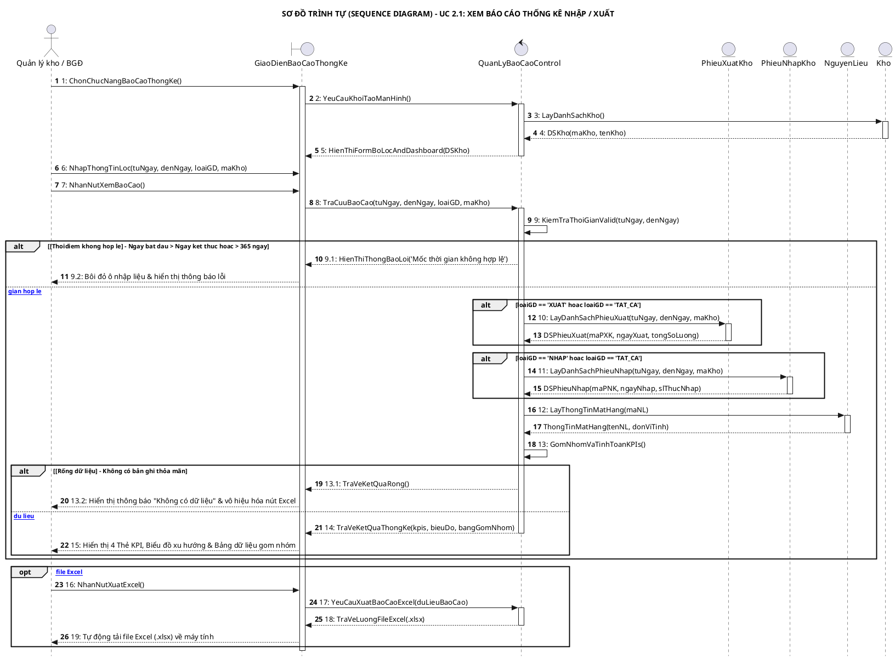
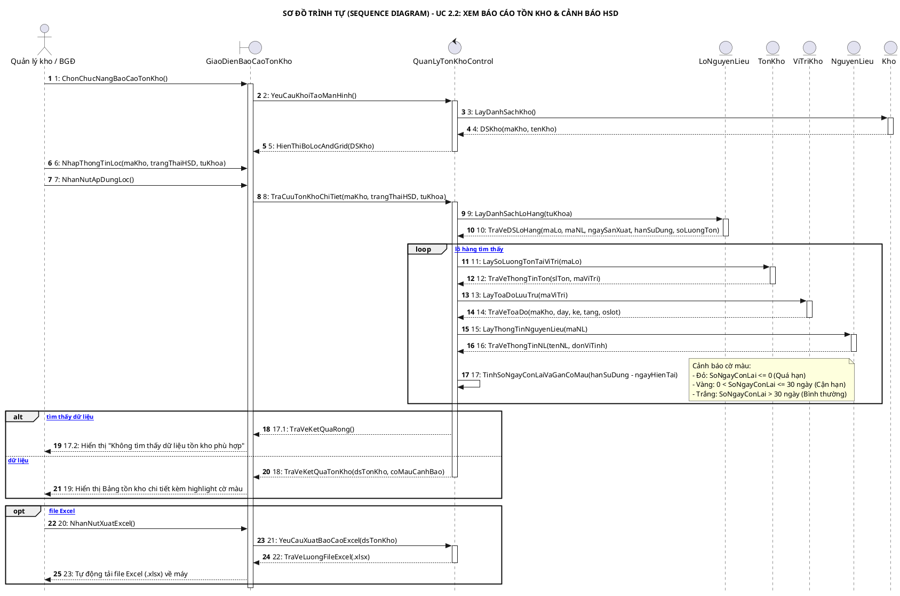
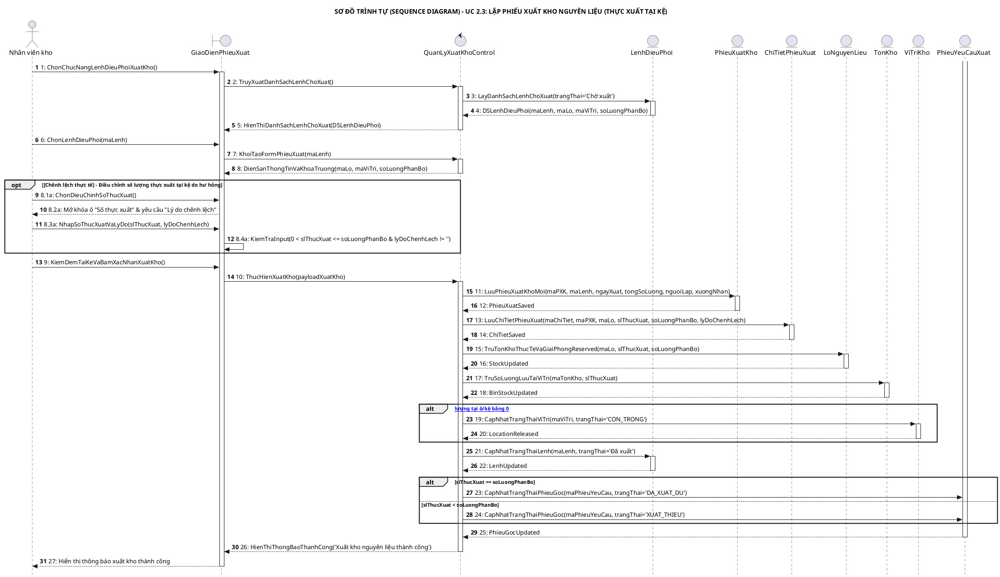
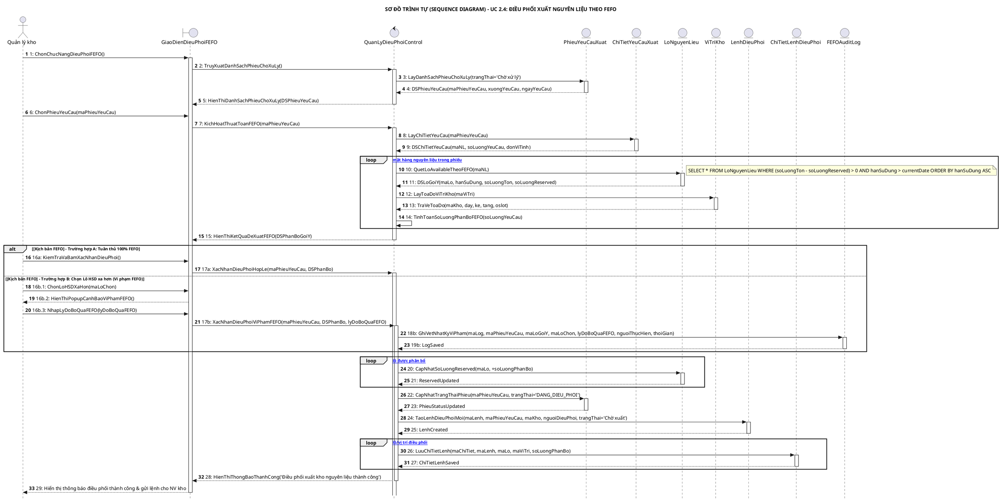
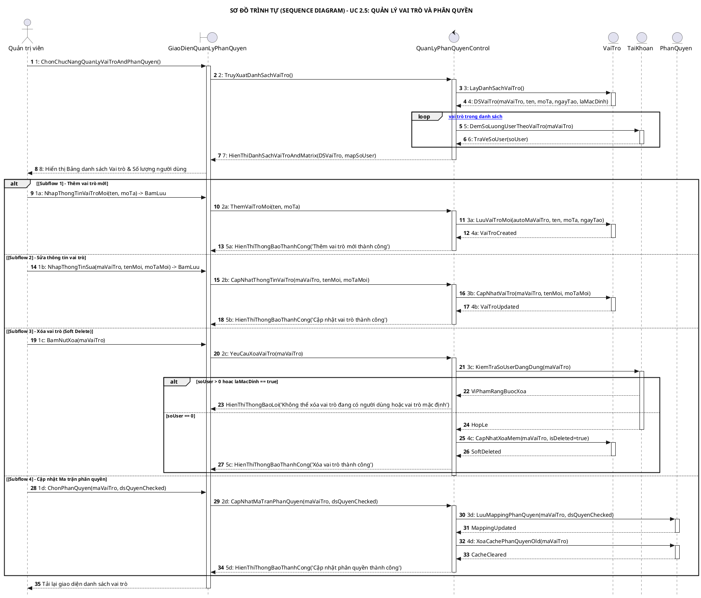

# BÁO CÁO PHÂN TÍCH VÀ THIẾT KẾ HƯỚNG ĐỐI TƯỢNG (OOAD) - MODULE 2

## TỔNG QUAN HỆ THỐNG VÀ PHẠM VI MODULE 2

Tài liệu này cung cấp toàn bộ kết quả phân tích và thiết kế chi tiết cho **Module 2: Quản lý xuất nguyên liệu và báo cáo** thuộc Hệ thống Quản lý Kho và Kế hoạch Sản xuất Nhà máy Bánh quy. Toàn bộ thiết kế tuân thủ mô hình 3 lớp **Boundary - Control - Entity (ECB)**, đồng bộ 100% với Sơ đồ CSDL Domain Model tổng thể (`domain_hethong.vpd.png`) và các yêu cầu nghiệp vụ thực tế từ giảng viên.

Module 2 bao gồm 5 Use Case cốt lõi:
1. **UC 2.1**: Xem báo cáo thống kê nhập/xuất
2. **UC 2.2**: Xem báo cáo tồn kho chi tiết & cảnh báo HSD
3. **UC 2.3**: Lập phiếu xuất kho nguyên liệu (Thực xuất tại kệ)
4. **UC 2.4**: Điều phối xuất nguyên liệu theo FEFO
5. **UC 2.5**: Quản lý vai trò và phân quyền

---

## 1. USE CASE 2.1: XEM BÁO CÁO THỐNG KÊ NHẬP / XUẤT

### 1.1. Bảng Đặc Tả Use Case 2.1

| Mục | Nội Dung |
| :--- | :--- |
| **Tên Use Case** | **Xem báo cáo thống kê nhập/xuất** |
| **Tiền điều kiện** | Quản lý kho hoặc Ban giám đốc đã đăng nhập thành công vào hệ thống. |
| **Hậu điều kiện** | Dữ liệu thống kê được hiển thị trực quan; file Excel (.xlsx) được xuất thành công nếu có yêu cầu. Hệ thống chỉ đọc dữ liệu, tuyệt đối không làm thay đổi CSDL. |
| **Actor chính** | Quản lý kho, Ban giám đốc |
| **Actor phụ** | Không |

#### Luồng Cơ Bản (Basic Flow)
* **Bước 1 (Actor)**: Người dùng bấm chọn chức năng "Báo cáo lịch sử Nhập/Xuất".
* **Bước 2 (Hệ thống)**: Hiển thị giao diện Màn hình Báo cáo gồm 4 khu vực:
  1. *Bộ lọc điều kiện*: Từ ngày, Đến ngày, Loại giao dịch (Dropdown: Nhập nguyên liệu / Xuất nguyên liệu / Tất cả), Kho.
  2. *Khu vực Thẻ KPI tổng hợp*: 4 thẻ chỉ số (Tổng sản lượng nhập, Tổng sản lượng xuất, Tổng số lượt giao dịch, Mặt hàng luân chuyển nhiều nhất).
  3. *Khu vực Biểu đồ*: Biểu đồ Cột/Đường thể hiện biến động sản lượng Nhập vs. Xuất theo thời gian.
  4. *Khu vực Bảng dữ liệu gom nhóm*: Danh sách gom nhóm theo Mặt hàng (gồm các cột: Mã nguyên liệu, Tên mặt hàng, Đơn vị tính, Tổng lượng nhập trong kỳ, Tổng lượng xuất trong kỳ, Tồn cuối kỳ) kèm bộ phân trang.
* **Bước 3 (Actor)**: Chọn khoảng thời gian (Từ ngày, Đến ngày), chọn Loại giao dịch, chọn Kho và bấm "Xem báo cáo".
* **Bước 4 (Hệ thống)**: Kiểm tra dữ liệu đầu vào: Từ ngày $\le$ Đến ngày, khoảng cách giữa Từ ngày và Đến ngày không vượt quá 365 ngày.
* **Bước 5 (Hệ thống)**: Truy vấn CSDL (`PhieuXuatKho`, `PhieuNhapKho`, `NguyenLieu`, `Kho`), gom nhóm sản lượng theo từng mã mặt hàng và tính toán các chỉ số tổng hợp.
* **Bước 6 (Hệ thống)**: Hiển thị số liệu tính toán lên 4 Thẻ KPI, vẽ biểu đồ xu hướng và nạp danh sách gom nhóm vào Bảng dữ liệu.
* **Bước 7 (Actor)**: Bấm chọn nút "Xuất file Excel".
* **Bước 8 (Hệ thống)**: Trích xuất toàn bộ dữ liệu đang hiển thị trên Bảng dữ liệu thành file định dạng `.xlsx` và tự động tải về máy tính.

#### Luồng Thay Thế & Ngoại Lệ (Alternative & Exception Flows)
* **4.1. Ngày bắt đầu lớn hơn Ngày kết thúc**: Hệ thống dừng xử lý, bôi đỏ ô nhập Từ ngày và hiển thị thông báo lỗi *"Ngày bắt đầu không được lớn hơn ngày kết thúc"*. Quay lại bước 3.
* **4.2. Dải thời gian vượt quá 365 ngày**: Hệ thống dừng xử lý và hiển thị thông báo *"Khoảng thời gian tra cứu tối đa là 1 năm (365 ngày). Vui lòng chọn lại"*. Quay lại bước 3.
* **5.1. Không có dữ liệu giao dịch phát sinh trong kỳ**: Hệ thống hiển thị 4 Thẻ KPI với giá trị bằng 0, Biểu đồ trạng thái rỗng và Bảng dữ liệu hiển thị *"Không có dữ liệu giao dịch trong khoảng thời gian đã chọn"*. Vô hiệu hóa (disable) nút "Xuất file Excel". Quay lại bước 3.
* **8.1. Lỗi khởi tạo file Excel**: Hệ thống hiển thị thông báo lỗi *"Không thể tạo file báo cáo lúc này, vui lòng thử lại sau"*. Kết thúc Use Case.

---

### 1.2. Các Lớp Khái Niệm Và Thuộc Tính (Domain Model Alignment)

* **`PhieuXuatKho`**(`maPXK`, `ngayXuat`, `tongSoLuong`, `nguoiLap`, `maKho`, `trangThai`)
* **`PhieuNhapKho`**(`maPNK`, `ngayNhap`, `slThucNhap`, `nguoiLap`, `maKho`, `trangThai`)
* **`NguyenLieu`**(`maNL`, `tenNL`, `donViTinh`, `loaiKhoBaoQuan`)
* **`Kho`**(`maKho`, `tenKho`, `loaiKho`)

---

### 1.3. Mã PlantUML Sequence Diagram UC 2.1

---

### 1.4. Phân Tích OOAD Chi Tiết Của UC 2.1

#### A. Xác Định Các Lớp (Classes)
* **Lớp Boundary**: `GiaoDienBaoCaoThongKe`
* **Lớp Control**: `QuanLyBaoCaoControl`
* **Lớp Entity**: `PhieuXuatKho`, `PhieuNhapKho`, `NguyenLieu`, `Kho`

#### B. Ánh Xạ Phương Thức (Operations Mapping)

| Lớp Nhận Message | Phương Thức Signature | Diễn Giải Chi Tiết |
| :--- | :--- | :--- |
| `GiaoDienBaoCaoThongKe` | `hienThiFormBoLocAndDashboard(DSKho)` | Hiển thị các trường chọn thời gian, loại giao dịch, danh sách kho và các khung hiển thị. |
| `GiaoDienBaoCaoThongKe` | `hienThiThongBaoLoi(thongBao: String)` | Hiển thị thông báo lỗi validation thời gian hoặc lỗi hệ thống. |
| `GiaoDienBaoCaoThongKe` | `hienThiSoLieuBaoCao(kpis, bieuDo, bangGomNhom)` | Đưa dữ liệu đã tính toán lên 4 thẻ KPI, vẽ biểu đồ và nạp bảng phân trang. |
| `GiaoDienBaoCaoThongKe` | `taiFileExcel(fileStream)` | Kích hoạt luồng tải file `.xlsx` về thiết bị người dùng. |
| `QuanLyBaoCaoControl` | `yeuCauKhoiTaoManHinh()` | Xử lý yêu cầu mở màn hình, gọi lấy danh mục kho. |
| `QuanLyBaoCaoControl` | `traCuuBaoCao(tuNgay, denNgay, loaiGD, maKho)` | Điều phối luồng tra cứu báo cáo theo tham số lọc. |
| `QuanLyBaoCaoControl` | `kiemTraThoiGianValid(tuNgay, denNgay) : boolean` | Kiểm tra quy tắc ngày bắt đầu $\le$ ngày kết thúc và dải ngày $\le 365$. |
| `QuanLyBaoCaoControl` | `gomNhomVaTinhToanKPIs()` | Thực hiện gom nhóm sản lượng theo mã mặt hàng và tính toán 4 chỉ số KPI. |
| `QuanLyBaoCaoControl` | `yeuCauXuatBaoCaoExcel(duLieuBaoCao)` | Đóng gói dữ liệu báo cáo thành file Excel. |
| `PhieuXuatKho` | `layDanhSachPhieuXuat(tuNgay, denNgay, maKho) : List<PhieuXuatKho>` | Truy vấn danh sách chứng từ xuất kho thỏa mãn mốc thời gian và kho. |
| `PhieuNhapKho` | `layDanhSachPhieuNhap(tuNgay, denNgay, maKho) : List<PhieuNhapKho>` | Truy vấn danh sách chứng từ nhập kho thỏa mãn mốc thời gian và kho. |
| `NguyenLieu` | `layThongTinMatHang(maNL) : NguyenLieu` | Truy vấn tên nguyên liệu và đơn vị tính theo mã nguyên liệu. |
| `Kho` | `layDanhSachKho() : List<Kho>` | Truy vấn danh sách toàn bộ các kho để nạp vào dropdown lọc. |

#### C. Mối Quan Hệ (Associations)
* **Boundary $\rightarrow$ Control**: `GiaoDienBaoCaoThongKe` $\rightarrow$ `QuanLyBaoCaoControl` (Quan hệ Association 1-1): Màn hình gửi yêu cầu lọc/xuất báo cáo và nhận ViewModel hiển thị.
* **Control $\rightarrow$ Entities**: `QuanLyBaoCaoControl` $\rightarrow$ `PhieuXuatKho` (1-n), `PhieuNhapKho` (1-n), `NguyenLieu` (1-n), `Kho` (1-n): Control gọi truy vấn đọc dữ liệu từ các Entity.
* **Entity $\rightarrow$ Entity (Domain Model)**:
  * `Kho` (1) —— (0..*) `PhieuXuatKho`: Một kho có thể có nhiều phiếu xuất.
  * `Kho` (1) —— (0..*) `PhieuNhapKho`: Một kho có thể có nhiều phiếu nhập.
  * `NguyenLieu` (1) —— (0..*) `PhieuXuatKho` / `PhieuNhapKho`: Mỗi dòng chứng từ nhập/xuất liên kết với một nguyên liệu.

---

## 2. USE CASE 2.2: XEM BÁO CÁO TỒN KHO CHI TIẾT & CẢNH BÁO HSD

### 2.1. Bảng Đặc Tả Use Case 2.2

| Mục | Nội Dung |
| :--- | :--- |
| **Tên Use Case** | **Xem báo cáo tồn kho chi tiết & cảnh báo HSD** |
| **Tiền điều kiện** | Quản lý kho hoặc Ban giám đốc đã đăng nhập thành công vào hệ thống. |
| **Hậu điều kiện** | Báo cáo tồn kho chi tiết được hiển thị. Cho phép xuất file Excel. Tuyệt đối không làm thay đổi CSDL. |
| **Actor chính** | Quản lý kho, Ban giám đốc |
| **Actor phụ** | Không |

#### Luồng Cơ Bản (Basic Flow)
* **Bước 1 (Actor)**: Bấm chọn chức năng "Báo cáo tồn kho".
* **Bước 2 (Hệ thống)**: Hiển thị giao diện gồm:
  1. *Bộ lọc điều kiện*: Kho, Trạng thái hạn sử dụng (Dropdown: Tất cả / Quá hạn / Cận hạn / Bình thường), Tên nguyên liệu hoặc Mã Lô.
  2. *Bảng dữ liệu tồn kho chi tiết*: Các cột Mã Lô, Tên nguyên liệu, Đơn vị tính, Số lượng tồn thực tế, Ngày sản xuất (NSX), Hạn sử dụng (HSD), Số ngày còn lại, Vị trí lưu trữ (Kho - Dãy - Kệ - Tầng - Ô).
* **Bước 3 (Actor)**: Chọn các tiêu chí lọc và bấm nút "Áp dụng lọc".
* **Bước 4 (Hệ thống)**: Kết nối bảng Lô hàng (`LoNguyenLieu`), Tồn kho thực tế (`TonKho`), Vị trí kho (`ViTriKho`) và Nguyên liệu (`NguyenLieu`) để truy vấn dữ liệu thỏa mãn.
* **Bước 5 (Hệ thống)**: Hiển thị bảng danh sách kết quả phân trang và áp dụng quy tắc highlight màu sắc:
  * **Tô màu Đỏ**: Các Lô hàng có $HSD - NgayHienTai \le 0$ (Quá hạn) hoặc có số lượng tồn dưới định mức tối thiểu.
  * **Tô màu Vàng**: Các Lô hàng cận hạn sử dụng ($0 < SoNgayConLai \le 30$ ngày).
  * **Tô màu Trắng/Bình thường**: Các Lô hàng có $SoNgayConLai > 30$ ngày.
* **Bước 6 (Actor)**: Bấm chọn nút "Xuất file Excel".
* **Bước 7 (Hệ thống)**: Đóng gói toàn bộ danh sách dữ liệu tồn kho thành file `.xlsx` và tải về thiết bị.

#### Luồng Thay Thế & Ngoại Lệ (Alternative & Exception Flows)
* **5.1. Không tìm thấy dữ liệu tồn kho khớp bộ lọc**: Hệ thống hiển thị Bảng rỗng kèm thông báo *"Không tìm thấy dữ liệu tồn kho phù hợp với điều kiện lọc"*. Vô hiệu hóa nút Xuất Excel. Quay lại bước 3.
* **4.1. Lỗi quá thời gian chờ truy vấn (Timeout)**: Quá trình truy vấn CSDL vượt quá 10 giây do lượng dữ liệu lớn. Hệ thống ngắt kết nối và hiển thị thông báo *"Thời gian truy vấn quá lâu, vui lòng thử lại sau"*. Kết thúc Use Case.

---

### 2.2. Các Lớp Khái Niệm Và Thuộc Tính

* **`LoNguyenLieu`**(`maLo`, `maNL`, `ngaySanXuat`, `hanSuDung`, `soLuongTon`, `soLuongReserved`, `trangThai`)
* **`TonKho`**(`maTonKho`, `maLo`, `maViTri`, `slTon`, `ngayCapNhat`, `trangThai`)
* **`ViTriKho`**(`maViTri`, `maKho`, `day`, `ke`, `tang`, `oslot`, `trangThai`)
* **`NguyenLieu`**(`maNL`, `tenNL`, `donViTinh`, `loaiKhoBaoQuan`)
* **`Kho`**(`maKho`, `tenKho`, `loaiKho`)

---

### 2.3. Mã PlantUML Sequence Diagram UC 2.2

---

### 2.4. Phân Tích OOAD Chi Tiết Của UC 2.2

#### A. Xác Định Các Lớp (Classes)
* **Lớp Boundary**: `GiaoDienBaoCaoTonKho`
* **Lớp Control**: `QuanLyTonKhoControl`
* **Lớp Entity**: `LoNguyenLieu`, `TonKho`, `ViTriKho`, `NguyenLieu`, `Kho`

#### B. Ánh Xạ Phương Thức (Operations Mapping)

| Lớp Nhận Message | Phương Thức Signature | Diễn Giải Chi Tiết |
| :--- | :--- | :--- |
| `GiaoDienBaoCaoTonKho` | `hienThiBoLocAndGrid(DSKho)` | Khởi tạo giao diện tìm kiếm tồn kho kèm dropdown kho. |
| `GiaoDienBaoCaoTonKho` | `hienThiBangTonKhoKemCoMauCanhBao(dsTonKho, coMauCanhBao)` | Nạp lưới dữ liệu tồn kho kèm cờ màu Đỏ/Vàng/Trắng. |
| `GiaoDienBaoCaoTonKho` | `hienThiThongBaoRong()` | Hiển thị thông báo khi không tìm thấy lô hàng phù hợp. |
| `GiaoDienBaoCaoTonKho` | `taiFileExcel(fileStream)` | Kích hoạt luồng tải xuống file Excel báo cáo tồn kho. |
| `QuanLyTonKhoControl` | `yeuCauKhoiTaoManHinh()` | Xử lý mở màn hình báo cáo tồn kho. |
| `QuanLyTonKhoControl` | `traCuuTonKhoChiTiet(maKho, trangThaiHSD, tuKhoa)` | Thực hiện liên kết thông tin giữa các thực thể và tính số ngày còn lại. |
| `QuanLyTonKhoControl` | `tinhSoNgayConLaiVaGanCoMau(hanSuDung, ngayHienTai)` | Quy đổi ngày hết hạn thành số ngày còn lại và chọn cờ màu tương ứng. |
| `QuanLyTonKhoControl` | `yeuCauXuatBaoCaoExcel(dsTonKho)` | Đóng gói danh sách tồn kho hiện tại thành file Excel. |
| `LoNguyenLieu` | `layDanhSachLoHang(tuKhoa) : List<LoNguyenLieu>` | Truy vấn danh sách lô nguyên liệu thỏa mãn từ khóa tìm kiếm. |
| `TonKho` | `laySoLuongTonTaiViTri(maLo) : TonKho` | Truy vấn số lượng tồn thực tế lưu tại ô/kệ theo mã lô. |
| `ViTriKho` | `layToaDoLuuTru(maViTri) : ViTriKho` | Truy vấn tọa độ lưu trữ (Kho, Dãy, Kệ, Tầng, Ô) theo mã vị trí. |
| `NguyenLieu` | `layThongTinNguyenLieu(maNL) : NguyenLieu` | Lấy tên nguyên liệu và đơn vị tính theo mã nguyên liệu. |
| `Kho` | `layDanhSachKho() : List<Kho>` | Lấy danh sách kho phục vụ bộ lọc. |

#### C. Mối Quan Hệ (Associations)
* **Boundary $\rightarrow$ Control**: `GiaoDienBaoCaoTonKho` $\rightarrow$ `QuanLyTonKhoControl` (Association 1-1).
* **Control $\rightarrow$ Entities**: `QuanLyTonKhoControl` $\rightarrow$ `LoNguyenLieu` (1-n), `TonKho` (1-n), `ViTriKho` (1-n), `NguyenLieu` (1-n), `Kho` (1-n).
* **Entity $\rightarrow$ Entity (Domain Model)**:
  * `NguyenLieu` (1) —— (0..*) `LoNguyenLieu`: Một nguyên liệu có nhiều lô nhập.
  * `LoNguyenLieu` (1) —— (0..*) `TonKho`: Một lô hàng có thể phân bổ tồn ở nhiều vị trí ô/kệ.
  * `ViTriKho` (1) —— (0..*) `TonKho`: Một vị trí ô/kệ lưu giữ bản ghi tồn kho của một lô.
  * `Kho` (1) —— (0..*) `ViTriKho`: Một kho chứa nhiều vị trí Dãy - Kệ - Tầng - Ô.

---

## 3. USE CASE 2.3: LẬP PHIẾU XUẤT KHO NGUYÊN LIỆU (THỰC XUẤT TẠI KỆ)

### 3.1. Bảng Đặc Tả Use Case 2.3

| Mục | Nội Dung |
| :--- | :--- |
| **Tên Use Case** | **Lập phiếu xuất kho nguyên liệu (Thực xuất tại kệ)** |
| **Tiền điều kiện** | Quản lý kho đã lập Lệnh điều phối ở trạng thái "Chờ xuất". Nhân viên kho đã đăng nhập thành công vào hệ thống. |
| **Hậu điều kiện** | Phiếu Xuất Kho chính thức được lưu. Tồn kho thực tế của Lô bị trừ đi. Số lượng tạm khóa (`soLuongReserved`) được giải phóng. Nếu ô/kệ rỗng (`slTon = 0`), vị trí đó tự động đổi trạng thái sang "CON_TRONG". Lệnh điều phối chuyển trạng thái thành "Đã xuất" và Phiếu yêu cầu gốc chuyển sang "Đã xuất đủ" hoặc "Xuất thiếu". |
| **Actor chính** | Nhân viên kho |
| **Actor phụ** | Không |

#### Luồng Cơ Bản (Basic Flow)
* **Bước 1 (Actor)**: Nhân viên kho chọn chức năng "Lệnh điều phối xuất kho".
* **Bước 2 (Hệ thống)**: Hiển thị Danh sách các lệnh điều phối đang ở trạng thái "Chờ xuất" thuộc quyền phụ trách của nhân viên.
* **Bước 3 (Actor)**: Nhấp chọn một lệnh điều phối cụ thể.
* **Bước 4 (Hệ thống)**: Hiển thị tóm tắt thông tin Lệnh điều phối (Mã lệnh, Vị trí Dãy-Kệ-Tầng-Ô, Mã Lô, Tên nguyên liệu, Số lượng phân bổ).
* **Bước 5 (Actor)**: Bấm nút "Lập phiếu xuất".
* **Bước 6 (Hệ thống)**: Hiển thị Form "Phiếu xuất kho", tự động điền sẵn thông tin từ Lệnh điều phối và khóa (disable) các ô Mã lô, Vị trí, Số lượng phân bổ.
* **Bước 7 (Actor)**: Đến vị trí kệ thực tế kiểm đếm đủ số lượng và bấm nút "Xác nhận xuất kho".
* **Bước 8 (Hệ thống)**: Thực hiện chuỗi xử lý tự động trong CSDL:
  1. Lưu bản ghi `PhieuXuatKho` mới và `ChiTietPhieuXuat`.
  2. Trừ `soLuongTon` thực tế của `LoNguyenLieu` theo đúng số lượng thực xuất.
  3. Trừ `soLuongReserved` (giải phóng tồn tạm khóa) của `LoNguyenLieu`.
  4. Trừ số lượng `slTon` lưu tại ô vị trí (`TonKho`). Nếu số lượng còn lại tại ô bằng 0, hệ thống tự động chuyển trạng thái của `ViTriKho` từ "Có hàng" sang "CON_TRONG".
  5. Cập nhật trạng thái `LenhDieuPhoi` thành "Đã xuất" và `PhieuYeuCauXuat` gốc thành "DA_XUAT_DU".
* **Bước 9 (Hệ thống)**: Hiển thị thông báo *"Xuất kho nguyên liệu thành công"*.

#### Luồng Thay Thế & Ngoại Lệ (Alternative & Exception Flows)
* **6.1. Điều chỉnh số lượng thực xuất (Do hư hỏng/thiếu hụt thực tế tại kệ)**:
  1. Nhân viên kho phát hiện nguyên liệu bị rách/vỡ bao bì tại kệ nên chọn "Điều chỉnh số thực xuất".
  2. Hệ thống mở khóa trường "Số lượng thực xuất" và hiển thị ô bắt buộc nhập *"Lý do chênh lệch"*.
  3. Nhân viên kho nhập số lượng thực xuất và lý do giải trình.
  4. Hệ thống kiểm tra: $0 < slThucXuat \le soLuongPhanBo$. Nếu bỏ trống Lý do chênh lệch, hệ thống chặn xác nhận và bôi đỏ ô Lý do.
  5. Sau khi dữ liệu hợp lệ, nhân viên bấm "Xác nhận xuất kho". Hệ thống trừ tồn kho theo số thực xuất, giải phóng toàn bộ lượng `Reserved` bị tạm khóa của lệnh này, lưu log chênh lệch và cập nhật `PhieuYeuCauXuat` gốc thành "XUAT_THIEU".
* **7.1. Mất kết nối CSDL trong lúc xác nhận**: Hệ thống Rollback toàn bộ giao dịch (tồn kho không bị trừ sai), hiển thị thông báo *"Kết nối bị gián đoạn, dữ liệu chưa được lưu"*. Kết thúc Use Case.

---

### 3.2. Các Lớp Khái Niệm Và Thuộc Tính

* **`LenhDieuPhoi`**(`maLenh`, `maPhieuYeuCau`, `maKho`, `ngayDieuPhoi`, `nguoiDieuPhoi`, `trangThai`)
* **`ChiTietLenhDieuPhoi`**(`maChiTiet`, `maLenh`, `maLo`, `maViTri`, `soLuongPhanBo`)
* **`PhieuXuatKho`**(`maPXK`, `maLenh`, `maKho`, `ngayXuat`, `nguoiLap`, `xuongNhan`, `tongSoLuong`, `lyDoChenhLech`, `trangThai`)
* **`ChiTietPhieuXuat`**(`maChiTiet`, `maPXK`, `maLo`, `slThucXuat`, `soLuongPhanBo`, `lyDoChenhLech`)
* **`LoNguyenLieu`**(`maLo`, `soLuongTon`, `soLuongReserved`)
* **`TonKho`**(`maTonKho`, `maLo`, `maViTri`, `slTon`, `ngayCapNhat`)
* **`ViTriKho`**(`maViTri`, `trangThai`)
* **`PhieuYeuCauXuat`**(`maPhieuYeuCau`, `trangThai`)

---

### 3.3. Mã PlantUML Sequence Diagram UC 2.3

---

### 3.4. Phân Tích OOAD Chi Tiết Của UC 2.3

#### A. Xác Định Các Lớp (Classes)
* **Lớp Boundary**: `GiaoDienPhieuXuat`
* **Lớp Control**: `QuanLyXuatKhoControl`
* **Lớp Entity**: `LenhDieuPhoi`, `PhieuXuatKho`, `ChiTietPhieuXuat`, `LoNguyenLieu`, `TonKho`, `ViTriKho`, `PhieuYeuCauXuat`

#### B. Ánh Xạ Phương Thức (Operations Mapping)

| Lớp Nhận Message | Phương Thức Signature | Diễn Giải Chi Tiết |
| :--- | :--- | :--- |
| `GiaoDienPhieuXuat` | `hienThiDanhSachLenhChoXuat(DSLenhDieuPhoi)` | Nạp danh sách các Lệnh điều phối đang chờ xuất kho. |
| `GiaoDienPhieuXuat` | `dienSanThongTinVaKhoaTruong(maLo, maViTri, soLuongPhanBo)` | Khởi tạo Form lập phiếu xuất với dữ liệu cố định từ lệnh. |
| `GiaoDienPhieuXuat` | `hienThiThongBaoThanhCong(thongBao: String)` | Thông báo hoàn tất quá trình xuất kho thực tế. |
| `QuanLyXuatKhoControl` | `truyXuatDanhSachLenhChoXuat()` | Tiếp nhận yêu cầu mở danh sách lệnh chờ xuất. |
| `QuanLyXuatKhoControl` | `khoiTaoFormPhieuXuat(maLenh)` | Truy xuất thông tin lệnh để chuẩn bị form xuất. |
| `QuanLyXuatKhoControl` | `thucHienXuatKho(payloadXuatKho)` | Quản lý chuỗi giao dịch CSDL cập nhật phiếu, trừ tồn và đổi trạng thái. |
| `LenhDieuPhoi` | `layDanhSachLenhChoXuat(trangThai: String) : List<LenhDieuPhoi>` | Truy vấn các bản ghi Lệnh điều phối có `trangThai = 'Chờ xuất'`. |
| `LenhDieuPhoi` | `capNhatTrangThaiLenh(maLenh, trangThai: String)` | Cập nhật trạng thái lệnh thành "Đã xuất". |
| `PhieuXuatKho` | `luuPhieuXuatKhoMoi(maPXK, maLenh, ngayXuat, tongSoLuong, nguoiLap, xuongNhan) : PhieuXuatKho` | Thêm bản ghi chứng từ xuất kho mới. |
| `ChiTietPhieuXuat` | `luuChiTietPhieuXuat(maChiTiet, maPXK, maLo, slThucXuat, soLuongPhanBo, lyDoChenhLech)` | Thêm chi tiết thực xuất từng lô hàng. |
| `LoNguyenLieu` | `truTonKhoThucTeVaGiaiPhongReserved(maLo, slThucXuat, soLuongPhanBo)` | Cập nhật $soLuongTon -= slThucXuat$ và $soLuongReserved -= soLuongPhanBo$. |
| `TonKho` | `truSoLuongLuuTaiViTri(maTonKho, slThucXuat) : TonKho` | Cập nhật trừ số lượng tồn thực tế lưu tại ô/kệ ($slTon -= slThucXuat$). |
| `ViTriKho` | `capNhatTrangThaiViTri(maViTri, trangThai: String)` | Đổi trạng thái vị trí ô/kệ sang `"CON_TRONG"` nếu $slTon = 0$. |
| `PhieuYeuCauXuat` | `capNhatTrangThaiPhieuGoc(maPhieuYeuCau, trangThai: String)` | Cập nhật trạng thái phiếu gốc thành `"DA_XUAT_DU"` hoặc `"XUAT_THIEU"`. |

#### C. Mối Quan Hệ (Associations)
* **Boundary $\rightarrow$ Control**: `GiaoDienPhieuXuat` $\rightarrow$ `QuanLyXuatKhoControl` (Association 1-1).
* **Control $\rightarrow$ Entities**: `QuanLyXuatKhoControl` $\rightarrow$ `LenhDieuPhoi` (1-n), `PhieuXuatKho` (1-n), `ChiTietPhieuXuat` (1-n), `LoNguyenLieu` (1-n), `TonKho` (1-n), `ViTriKho` (1-n), `PhieuYeuCauXuat` (1-n).
* **Entity $\rightarrow$ Entity (Domain Model)**:
  * `PhieuYeuCauXuat` (1) —— (0..1) `LenhDieuPhoi`: Một phiếu yêu cầu tạo ra lệnh điều phối.
  * `LenhDieuPhoi` (1) —— (0..1) `PhieuXuatKho`: Lệnh điều phối làm căn cứ lập phiếu xuất.
  * `PhieuXuatKho` (1) —— (1..*) `ChiTietPhieuXuat`: Một phiếu xuất chứa nhiều dòng chi tiết thực xuất.
  * `LoNguyenLieu` (1) —— (0..*) `ChiTietPhieuXuat`: Mỗi dòng chi tiết liên kết với một lô nguyên liệu.
  * `ViTriKho` (1) —— (0..*) `TonKho`: Vị trí ô/kệ quản lý lượng tồn của từng lô.

---

## 4. USE CASE 2.4: ĐIỀU PHỐI XUẤT NGUYÊN LIỆU THEO FEFO

### 4.1. Bảng Đặc Tả Use Case 2.4

| Mục | Nội Dung |
| :--- | :--- |
| **Tên Use Case** | **Điều phối xuất nguyên liệu theo FEFO** |
| **Tiền điều kiện** | Đã có Phiếu yêu cầu xuất nguyên liệu từ Xưởng sản xuất ở trạng thái "Chờ xử lý". Quản lý kho đã đăng nhập thành công. |
| **Hậu điều kiện** | Trạng thái Phiếu yêu cầu chuyển thành "Đang điều phối". Số lượng tồn kho tương ứng của Lô bị tạm khóa (`soLuongReserved` tăng lên). Lệnh điều phối xuất kho được tạo thành công và gửi thông báo đến Nhân viên kho. |
| **Actor chính** | Quản lý kho |
| **Actor phụ** | Không |

#### Luồng Cơ Bản (Basic Flow)
* **Bước 1 (Actor)**: Bấm chọn chức năng "Xuất kho nguyên liệu".
* **Bước 2 (Hệ thống)**: Truy xuất cơ sở dữ liệu và hiển thị danh sách các phiếu yêu cầu ở trạng thái "Chờ xử lý".
* **Bước 3 (Actor)**: Nhấp chọn một phiếu yêu cầu cần điều phối.
* **Bước 4 (Hệ thống)**: Hiển thị trang Chi tiết phiếu yêu cầu (Mã phiếu, Xưởng gửi, Tên nguyên liệu, Tổng số lượng cần xuất) và nút "Điều phối".
* **Bước 5 (Actor)**: Bấm nút "Điều phối".
* **Bước 6 (Hệ thống)**: Tự động kích hoạt **Thuật toán đề xuất FEFO**:
  1. Quét tất cả các Lô của nguyên liệu đó có $soLuongKhaDung = (soLuongTon - soLuongReserved) > 0$ và $hanSuDung > NgayHienTai$.
  2. Sắp xếp danh sách Lô ưu tiên theo $hanSuDung \text{ ASC}$ (Hạn sử dụng gần nhất xếp lên đầu).
  3. Lấy số lượng từ Lô cận hạn nhất. Nếu Lô đó không đủ, hệ thống tự động cộng dồn từ Lô cận hạn tiếp theo cho đến khi đạt đủ `soLuongYeuCau`.
  4. Hiển thị Bảng kết quả đề xuất gồm: Mã Lô, Ngày hết hạn (HSD), Tọa độ Vị trí (Kho - Dãy - Kệ - Tầng - Ô), Số lượng tồn khả dụng, Số lượng đề xuất phân bổ.
* **Bước 7 (Actor)**: Kiểm tra danh sách đề xuất và bấm nút "Xác nhận điều phối".
* **Bước 8 (Hệ thống)**: Thực hiện cập nhật CSDL: Cập nhật tăng `soLuongReserved` của các Lô hàng được chọn, chuyển trạng thái `PhieuYeuCauXuat` sang "Đang điều phối", tạo bản ghi mới trong bảng `LenhDieuPhoi` (và `ChiTietLenhDieuPhoi`) với trạng thái "Chờ xuất", phát sinh thông báo cho Nhân viên kho.
* **Bước 9 (Hệ thống)**: Hiển thị thông báo *"Điều phối xuất kho nguyên liệu thành công"*.

#### Luồng Thay Thế & Ngoại Lệ (Alternative & Exception Flows)
* **6.1. Tồn kho khả dụng không đủ đáp ứng yêu cầu**: Tổng `soLuongKhaDung` nhỏ hơn `soLuongYeuCau`. Hệ thống hiển thị cảnh báo lỗi màu đỏ *"Số lượng tồn kho khả dụng không đủ để đáp ứng yêu cầu"*, vô hiệu hóa nút "Xác nhận điều phối".
* **7.1. Quản lý kho cố tình chọn Lô vi phạm quy tắc FEFO (Chọn lô HSD xa hơn)**:
  1. Quản lý kho chọn Lô có HSD xa hơn Lô cận hạn do hệ thống gợi ý và bấm "Xác nhận điều phối".
  2. Hệ thống mở Popup cảnh báo *"Bạn đang bỏ qua lô cận hạn. Bạn có chắc chắn muốn tiếp tục?"*.
  3. Nếu chọn "Hủy": Đóng Popup, giữ nguyên giao diện để chọn lại.
  4. Nếu chọn "Xác nhận tiếp tục": Hệ thống mở hộp thoại yêu cầu bắt buộc nhập *"Lý do bỏ qua lô cận hạn"*.
  5. Quản lý kho nhập lý do. Hệ thống ghi vết bản ghi vi phạm vào `FEFOAuditLog`. Chuyển tiếp sang bước 8.
* **8.1. Tổng số lượng phân bổ không bằng số lượng yêu cầu**: Hệ thống báo lỗi *"Tổng số lượng phân bổ phải bằng đúng số lượng yêu cầu trên phiếu"*. Dừng lưu.
* **9.1. Lỗi gián đoạn CSDL khi lưu Lệnh điều phối**: Sự cố mạng xảy ra khi đang lưu. Hệ thống Rollback giao dịch, hoàn tác phần số lượng tạm khóa và thông báo *"Lỗi cập nhật dữ liệu, vui lòng thử lại"*. Kết thúc Use Case.

---

### 4.2. Các Lớp Khái Niệm Và Thuộc Tính

* **`PhieuYeuCauXuat`**(`maPhieuYeuCau`, `maKeHoach`, `xuongYeuCau`, `ngayYeuCau`, `lyDoXuat`, `tongSoLuong`, `trangThai`)
* **`ChiTietYeuCauXuat`**(`maChiTiet`, `maPhieuYeuCau`, `maNL`, `soLuongYeuCau`, `donViTinh`)
* **`LoNguyenLieu`**(`maLo`, `maNL`, `ngaySanXuat`, `hanSuDung`, `soLuongTon`, `soLuongReserved`, `trangThai`)
* **`ViTriKho`**(`maViTri`, `maKho`, `day`, `ke`, `tang`, `oslot`)
* **`LenhDieuPhoi`**(`maLenh`, `maPhieuYeuCau`, `maKho`, `ngayDieuPhoi`, `nguoiDieuPhoi`, `trangThai`)
* **`ChiTietLenhDieuPhoi`**(`maChiTiet`, `maLenh`, `maLo`, `maViTri`, `soLuongPhanBo`)
* **`FEFOAuditLog`**(`maLog`, `maPhieuYeuCau`, `maLoGoiY`, `maLoChon`, `lyDoBoQuaFEFO`, `nguoiThucHien`, `thoiGian`)

---

### 4.3. Mã PlantUML Sequence Diagram UC 2.4

---

### 4.4. Phân Tích OOAD Chi Tiết Của UC 2.4

#### A. Xác Định Các Lớp (Classes)
* **Lớp Boundary**: `GiaoDienDieuPhoiFEFO`
* **Lớp Control**: `QuanLyDieuPhoiControl`
* **Lớp Entity**: `PhieuYeuCauXuat`, `ChiTietYeuCauXuat`, `LoNguyenLieu`, `ViTriKho`, `LenhDieuPhoi`, `ChiTietLenhDieuPhoi`, `FEFOAuditLog`

#### B. Ánh Xạ Phương Thức (Operations Mapping)

| Lớp Nhận Message | Phương Thức Signature | Diễn Giải Chi Tiết |
| :--- | :--- | :--- |
| `GiaoDienDieuPhoiFEFO` | `hienThiDanhSachPhieuChoXuLy(DSPhieuYeuCau)` | Nạp danh sách các phiếu yêu cầu xuất kho đang chờ xử lý. |
| `GiaoDienDieuPhoiFEFO` | `hienThiKetQuaDeXuatFEFO(DSPhanBoGoiY)` | Hiển thị bảng danh sách Lô cận hạn và vị trí ô/kệ đề xuất. |
| `GiaoDienDieuPhoiFEFO` | `hienThiPopupCanhBaoViPhamFEFO()` | Mở Popup cảnh báo khi Quản lý chọn lô HSD xa hơn. |
| `GiaoDienDieuPhoiFEFO` | `hienThiThongBaoThanhCong(thongBao: String)` | Thông báo hoàn tất tạo Lệnh điều phối. |
| `QuanLyDieuPhoiControl` | `truyXuatDanhSachPhieuChoXuLy()` | Tiếp nhận yêu cầu mở danh sách phiếu chờ xử lý. |
| `QuanLyDieuPhoiControl` | `kichHoatThuatToanFEFO(maPhieuYeuCau)` | Chạy thuật toán FEFO sắp xếp HSD ASC và tính số lượng phân bổ. |
| `QuanLyDieuPhoiControl` | `xacNhanDieuPhoiHopLe(maPhieuYeuCau, DSPhanBo)` | Xử lý chốt phân bổ tuân thủ FEFO. |
| `QuanLyDieuPhoiControl` | `xacNhanDieuPhoiViPhamFEFO(maPhieuYeuCau, DSPhanBo, lyDo)` | Xử lý chốt phân bổ vi phạm FEFO, gọi ghi Audit Log. |
| `PhieuYeuCauXuat` | `layDanhSachPhieuChoXuLy(trangThai: String) : List<PhieuYeuCauXuat>` | Truy vấn phiếu yêu cầu có `trangThai = 'Chờ xử lý'`. |
| `PhieuYeuCauXuat` | `capNhatTrangThaiPhieu(maPhieuYeuCau, trangThai: String)` | Cập nhật trạng thái sang `"DANG_DIEU_PHOI"`. |
| `ChiTietYeuCauXuat` | `layChiTietYeuCau(maPhieuYeuCau) : List<ChiTietYeuCauXuat>` | Truy vấn danh sách các mặt hàng nguyên liệu cần xuất. |
| `LoNguyenLieu` | `quetLoAvailableTheoFEFO(maNL) : List<LoNguyenLieu>` | Quét các lô có $soLuongKhaDung > 0$ và $hanSuDung > currentDate$ xếp $hanSuDung \text{ ASC}$. |
| `LoNguyenLieu` | `capNhatSoLuongReserved(maLo, soLuongPhanBo)` | Tăng $soLuongReserved += soLuongPhanBo$ để giữ chỗ hàng. |
| `ViTriKho` | `layToaDoViTriKho(maViTri) : ViTriKho` | Truy vấn vị trí ô/kệ lưu trữ của lô. |
| `LenhDieuPhoi` | `taoLenhDieuPhoiMoi(maLenh, maPhieuYeuCau, maKho, nguoiDieuPhoi, trangThai) : LenhDieuPhoi` | Khởi tạo bản ghi Lệnh điều phối mới. |
| `ChiTietLenhDieuPhoi` | `luuChiTietLenh(maChiTiet, maLenh, maLo, maViTri, soLuongPhanBo)` | Khởi tạo dòng chi tiết chỉ định lô/ô/kệ lấy hàng. |
| `FEFOAuditLog` | `ghiVetNhatKyViPham(maLog, maPhieuYeuCau, maLoGoiY, maLoChon, lyDoBoQuaFEFO, nguoiThucHien, thoiGian)` | Lưu vết vi phạm quy tắc FEFO để Ban giám đốc kiểm tra. |

#### C. Mối Quan Hệ (Associations)
* **Boundary $\rightarrow$ Control**: `GiaoDienDieuPhoiFEFO` $\rightarrow$ `QuanLyDieuPhoiControl` (Association 1-1).
* **Control $\rightarrow$ Entities**: `QuanLyDieuPhoiControl` $\rightarrow$ `PhieuYeuCauXuat` (1-n), `ChiTietYeuCauXuat` (1-n), `LoNguyenLieu` (1-n), `ViTriKho` (1-n), `LenhDieuPhoi` (1-n), `ChiTietLenhDieuPhoi` (1-n), `FEFOAuditLog` (1-n).
* **Entity $\rightarrow$ Entity (Domain Model)**:
  * `PhieuYeuCauXuat` (1) —— (1..*) `ChiTietYeuCauXuat`: Một phiếu chứa nhiều dòng nguyên liệu.
  * `PhieuYeuCauXuat` (1) —— (0..1) `LenhDieuPhoi`: Phiếu được điều phối thành lệnh.
  * `LenhDieuPhoi` (1) —— (1..*) `ChiTietLenhDieuPhoi`: Lệnh chỉ định nhiều dòng lô/vị trí.
  * `LoNguyenLieu` (1) —— (0..*) `ChiTietLenhDieuPhoi`: Lô nguyên liệu được phân bổ vào các lệnh.
  * `PhieuYeuCauXuat` (1) —— (0..*) `FEFOAuditLog`: Phiếu ghi nhận nhật ký vi phạm FEFO.

---

## 5. USE CASE 2.5: QUẢN LÝ VAI TRÒ VÀ PHÂN QUYỀN

### 5.1. Bảng Đặc Tả Use Case 2.5

| Mục | Nội Dung |
| :--- | :--- |
| **Tên Use Case** | **Quản lý vai trò và phân quyền** |
| **Tiền điều kiện** | Quản trị viên đã đăng nhập thành công vào hệ thống và có quyền truy cập chức năng Quản trị hệ thống. |
| **Hậu điều kiện** | Danh mục vai trò và ma trận phân quyền được lưu chính xác vào CSDL; Cache phân quyền của các phiên đăng nhập thuộc vai trò đó được tự động cập nhật/xóa để có hiệu lực ngay lập tức. |
| **Actor chính** | Quản trị viên |
| **Actor phụ** | Không |

#### Luồng Cơ Bản (Basic Flow)
* **Bước 1 (Actor)**: Chọn chức năng "Quản lý vai trò và phân quyền".
* **Bước 2 (Hệ thống)**: Truy xuất CSDL và hiển thị Danh sách các vai trò hiện có trong hệ thống (gồm các cột: Mã vai trò, Tên vai trò, Mô tả, Số lượng người dùng đang giữ vai trò, Ngày tạo).
* **Bước 3 (Actor)**: Chọn một trong các thao tác: "Thêm vai trò", "Sửa", "Xóa", hoặc "Phân quyền".

##### Subflow 1: Thêm vai trò mới
1. Actor bấm nút "Thêm vai trò".
2. Hệ thống hiển thị Popup/Form "Thêm vai trò mới" (gồm: Tên vai trò, Mô tả).
3. Actor nhập thông tin Tên vai trò, Mô tả và bấm "Lưu".
4. Hệ thống kiểm tra dữ liệu: Tên vai trò không bỏ trống, Tên vai trò là duy nhất.
5. Tự động sinh Mã vai trò (ví dụ: `ROLE_QC`, `ROLE_KHO`), lưu thông tin mới vào CSDL.
6. Hiển thị thông báo *"Thêm vai trò thành công"*, đóng Popup và tải lại danh sách vai trò.

##### Subflow 2: Sửa thông tin vai trò
1. Actor bấm nút "Sửa" tại một vai trò trong danh sách.
2. Hiển thị Popup/Form chứa dữ liệu hiện tại (Tên vai trò, Mô tả).
3. Actor chỉnh sửa thông tin cần thiết và bấm "Lưu".
4. Hệ thống kiểm tra Tên vai trò không trùng với vai trò khác và cập nhật CSDL.
5. Hiển thị thông báo *"Cập nhật vai trò thành công"*, đóng Form và tải lại danh sách.

##### Subflow 3: Xóa vai trò (Soft Delete)
1. Actor bấm nút "Xóa" tại vai trò muốn loại bỏ.
2. Hệ thống kiểm tra 2 quy tắc bắt buộc:
   * *Kiểm tra vai trò hệ thống*: Nếu thuộc nhóm mặc định không thể xóa (`laMacDinh = true` hoặc `SUPER_ADMIN`), chặn và báo *"Không thể xóa vai trò mặc định của hệ thống"*.
   * *Kiểm tra liên kết người dùng*: Nếu $soUser > 0$, chặn và báo *"Không thể xóa! Đang có [X] người dùng mang vai trò này. Vui lòng gán người dùng sang vai trò khác trước khi xóa"*.
3. Hiển thị Popup cảnh báo xác nhận: *"Bạn có chắc chắn muốn xóa vai trò [Tên vai trò] không?"*.
4. Actor bấm "Đồng ý".
5. Hệ thống thực hiện xóa mềm (cập nhật trạng thái `isDeleted = true`) trong CSDL và hiển thị thông báo *"Xóa vai trò thành công"*.

##### Subflow 4: Cập nhật ma trận phân quyền
1. Actor bấm nút "Phân quyền" tại một Vai trò cụ thể.
2. Mở Màn hình Phân quyền, hiển thị danh sách toàn bộ các Module/Chức năng trong hệ thống dưới dạng cây Checkbox với các nhóm quyền (Xem, Thêm, Sửa, Xóa, Duyệt). Các quyền vai trò đang có sẽ được tick sẵn.
3. Actor thực hiện đánh dấu (tick) chọn thêm quyền hoặc bỏ đánh dấu (uncheck) để rút bớt quyền.
4. Actor bấm "Lưu thiết lập".
5. Mapping lại các quyền cho vai trò trong CSDL (`PhanQuyen`), xóa Cache phân quyền cũ và hiển thị thông báo *"Cập nhật phân quyền thành công"*.

#### Luồng Thay Thế & Ngoại Lệ (Alternative & Exception Flows)
* **3.1. Dữ liệu trống / Trùng tên**: Hệ thống bôi đỏ ô nhập liệu và báo *"Vui lòng không bỏ trống trường này"* hoặc *"Tên vai trò đã tồn tại trong hệ thống. Vui lòng chọn tên khác"*.
* **3.2. Hủy thao tác**: Actor bấm "Hủy" hoặc "Đóng", hệ thống xóa dữ liệu đang nhập dở, đóng Popup và quay lại danh sách.
* **4.1. Lỗi máy chủ / Mất kết nối CSDL**: Hệ thống Rollback toàn bộ transaction, hiển thị thông báo *"Lỗi hệ thống. Vui lòng thử lại hoặc liên hệ quản trị viên"*. Giữ nguyên trạng thái Form.

---

### 5.2. Các Lớp Khái Niệm Và Thuộc Tính

* **`VaiTro`**(`maVaiTro`, `ten`, `moTa`, `ngayTao`, `isDeleted`, `laMacDinh`)
* **`TaiKhoan`**(`maTaiKhoan`, `maNV`, `maVaiTro`, `tenDangNhap`, `matKhau`, `ngayTao`, `trangThai`)
* **`PhanQuyen`**(`maVaiTro`, `maChucNang`, `xem`, `them`, `sua`, `xoa`, `duyet`)

---

### 5.3. Mã PlantUML Sequence Diagram UC 2.5

---

### 5.4. Phân Tích OOAD Chi Tiết Của UC 2.5

#### A. Xác Định Các Lớp (Classes)
* **Lớp Boundary**: `GiaoDienQuanLyPhanQuyen`
* **Lớp Control**: `QuanLyPhanQuyenControl`
* **Lớp Entity**: `VaiTro`, `TaiKhoan`, `PhanQuyen`

#### B. Ánh Xạ Phương Thức (Operations Mapping)

| Lớp Nhận Message | Phương Thức Signature | Diễn Giải Chi Tiết |
| :--- | :--- | :--- |
| `GiaoDienQuanLyPhanQuyen` | `hienThiDanhSachVaiTroAndMatrix(DSVaiTro, mapSoUser)` | Hiển thị bảng danh sách vai trò kèm số người dùng gắn vào mỗi vai trò. |
| `GiaoDienQuanLyPhanQuyen` | `hienThiThongBaoLoi(thongBao: String)` | Hiển thị thông báo khi tên trùng hoặc vi phạm ràng buộc xóa. |
| `GiaoDienQuanLyPhanQuyen` | `hienThiThongBaoThanhCong(thongBao: String)` | Hiển thị thông báo sau khi thêm/sửa/xóa/phân quyền thành công. |
| `QuanLyPhanQuyenControl` | `truyXuatDanhSachVaiTro()` | Lấy danh sách vai trò và đếm số lượng tài khoản theo từng vai trò. |
| `QuanLyPhanQuyenControl` | `themVaiTroMoi(ten, moTa)` | Kiểm tra hợp lệ và sinh mã vai trò mới. |
| `QuanLyPhanQuyenControl` | `capNhatThongTinVaiTro(maVaiTro, tenMoi, moTaMoi)` | Kiểm tra trùng tên và cập nhật thông tin vai trò. |
| `QuanLyPhanQuyenControl` | `yeuCauXoaVaiTro(maVaiTro)` | Kiểm tra quy tắc xóa (soUser = 0 và không mặc định) trước khi đánh dấu xóa mềm. |
| `QuanLyPhanQuyenControl` | `capNhatMaTranPhanQuyen(maVaiTro, dsQuyenChecked)` | Lưu ma trận phân quyền mới và xóa cache phiên đăng nhập cũ. |
| `VaiTro` | `layDanhSachVaiTro() : List<VaiTro>` | Truy vấn các vai trò có `isDeleted = false`. |
| `VaiTro` | `luuVaiTroMoi(autoMaVaiTro, ten, moTa, ngayTao) : VaiTro` | Tạo bản ghi vai trò mới. |
| `VaiTro` | `capNhatVaiTro(maVaiTro, tenMoi, moTaMoi)` | Cập nhật tên và mô tả vai trò. |
| `VaiTro` | `capNhatXoaMem(maVaiTro, isDeleted: boolean)` | Cập nhật cờ `isDeleted = true`. |
| `TaiKhoan` | `demSoLuongUserTheoVaiTro(maVaiTro) : int` | Đếm số lượng người dùng đang được gán `maVaiTro`. |
| `PhanQuyen` | `luuMappingPhanQuyen(maVaiTro, dsQuyenChecked)` | Ghi đè ma trận phân quyền (Xem, Thêm, Sửa, Xóa, Duyệt) cho vai trò. |
| `PhanQuyen` | `xoaCachePhanQuyenOld(maVaiTro)` | Làm mới cache phân quyền để thiết lập mới có hiệu lực ngay lập tức. |

#### C. Mối Quan Hệ (Associations)
* **Boundary $\rightarrow$ Control**: `GiaoDienQuanLyPhanQuyen` $\rightarrow$ `QuanLyPhanQuyenControl` (Association 1-1).
* **Control $\rightarrow$ Entities**: `QuanLyPhanQuyenControl` $\rightarrow$ `VaiTro` (1-n), `TaiKhoan` (1-n), `PhanQuyen` (1-n).
* **Entity $\rightarrow$ Entity (Domain Model)**:
  * `VaiTro` (1) —— (0..*) `TaiKhoan`: Một vai trò có thể gán cho nhiều tài khoản người dùng.
  * `VaiTro` (1) —— (0..*) `PhanQuyen`: Một vai trò có nhiều quy định phân quyền trên các chức năng.

---

## 6. TỔNG HỢP MỐI QUAN HỆ HỆ THỐNG TRONG MODULE 2

### 6.1. Bảng Tổng Hợp Mối Quan Hệ Giữa Boundary Và Control
Mỗi màn hình giao diện người dùng tương tác trực tiếp với một lớp điều khiển tương ứng để gửi yêu cầu và nhận dữ liệu phản hồi:

| Lớp Boundary | Lớp Control Liên Kết | Loại Quan Hệ | Mục Đích Nghiệp Vụ |
| :--- | :--- | :--- | :--- |
| `GiaoDienBaoCaoThongKe` | `QuanLyBaoCaoControl` | Association (1-1) | Tra cứu và trích xuất báo cáo thống kê Nhập/Xuất. |
| `GiaoDienBaoCaoTonKho` | `QuanLyTonKhoControl` | Association (1-1) | Truy vấn tồn kho chi tiết và tính toán cờ màu HSD. |
| `GiaoDienPhieuXuat` | `QuanLyXuatKhoControl` | Association (1-1) | Thực hiện quy trình lập phiếu xuất kho thực tế tại kệ. |
| `GiaoDienDieuPhoiFEFO` | `QuanLyDieuPhoiControl` | Association (1-1) | Chạy thuật toán FEFO và chốt lệnh điều phối xuất kho. |
| `GiaoDienQuanLyPhanQuyen` | `QuanLyPhanQuyenControl` | Association (1-1) | Thêm, sửa, xóa mềm vai trò và lưu ma trận phân quyền. |

### 6.2. Bảng Tổng Hợp Mối Quan Hệ Giữa Control Và Các Entity
Các lớp Control giữ vai trò điều hướng luồng dữ liệu, thực thi logic nghiệp vụ và tương tác với các thực thể CSDL:

| Lớp Control | Các Lớp Entity Tương Tác | Tần Suất & Bổ Thể |
| :--- | :--- | :--- |
| `QuanLyBaoCaoControl` | `PhieuXuatKho`, `PhieuNhapKho`, `NguyenLieu`, `Kho` | Đọc dữ liệu từ 4 Entity để tổng hợp KPI và gom nhóm. |
| `QuanLyTonKhoControl` | `LoNguyenLieu`, `TonKho`, `ViTriKho`, `NguyenLieu`, `Kho` | Đọc dữ liệu tồn kho từ 5 Entity để tính toán cờ cảnh báo. |
| `QuanLyXuatKhoControl` | `LenhDieuPhoi`, `PhieuXuatKho`, `ChiTietPhieuXuat`, `LoNguyenLieu`, `TonKho`, `ViTriKho`, `PhieuYeuCauXuat` | Cập nhật dữ liệu đồng thời trên 7 Entity khi xác nhận xuất kho. |
| `QuanLyDieuPhoiControl` | `PhieuYeuCauXuat`, `ChiTietYeuCauXuat`, `LoNguyenLieu`, `ViTriKho`, `LenhDieuPhoi`, `ChiTietLenhDieuPhoi`, `FEFOAuditLog` | Cập nhật tạm khóa tồn, tạo lệnh mới và ghi log trên 7 Entity. |
| `QuanLyPhanQuyenControl` | `VaiTro`, `TaiKhoan`, `PhanQuyen` | Đọc/Ghi dữ liệu danh mục và phân quyền trên 3 Entity. |

---

## KẾT LUẬN

Bản thiết kế Phân tích và Thiết kế Hướng đối tượng (OOAD) cho **Module 2** trên đây đã giải quyết trọn vẹn toàn bộ các yêu cầu khắt khe của bài toán:
1. Đảm bảo tính liền mạch giữa **Đặc tả Use Case**, **Sequence Diagram** và **Mô hình Lớp (Class Diagram)**.
2. Chuẩn hóa 100% tên thuộc tính và lớp thực thể theo Sơ đồ CSDL Domain Model tổng thể (`domain_hethong.vpd.png`).
3. Xác định chính xác các **Operations (Phương thức)** của từng lớp dựa trên các thông điệp gửi nhận trong Sequence Diagram.
4. Thiết lập đầy đủ các **Associations (Mối quan hệ)** giữa Boundary - Control, Control - Entity, và Entity - Entity.
